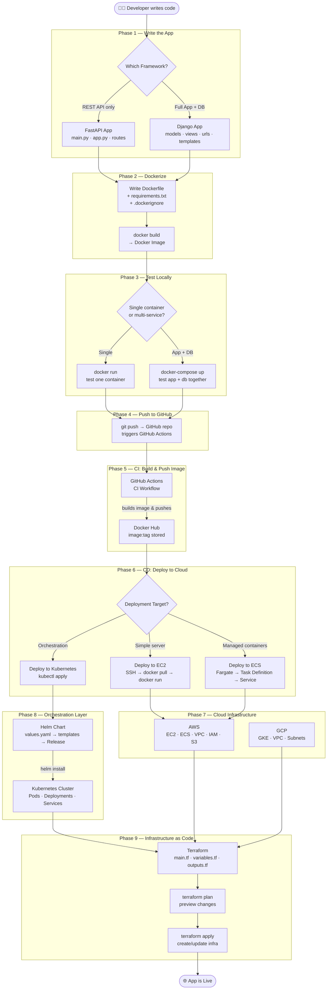

# DevOps & SRE — End-to-End Workflow

> **Goal:** See how every note connects — what each step takes as input, what it produces, and where that output goes next.

---

## Master Pipeline Flowchart



---

## Phase-by-Phase Breakdown

### Phase 1 — Write the App

| | FastAPI Path | Django Path |
|---|---|---|
| **Input** | Idea + API requirements | Idea + full app (frontend + DB) |
| **You write** | `main.py`, `app.py`, route files | project + app via `django-admin`, models, views, urls |
| **Output** | Python source code (REST API) | Python source code (full-stack web app) |
| **Run locally** | `uvicorn main:app --reload` | `python manage.py runserver` |

**Notes to read first:**
- [FastAPI Notes](fastapi_notes.md) — framework concepts, routes, params, Pydantic
- [main.py explained](main.py.md) — line-by-line breakdown of FastAPI entry point
- [app.py explained](app.py.md) — modular route structure
- [Django Notes](django_notes.md) — models, views, templates, commands
- [Poll App Django](pollapp_django.md) — real project walkthrough

---

### Phase 2 — Dockerize

```
Input:  source code + requirements.txt
         ↓
        Dockerfile (copy code → install deps → set entry point)
         ↓
Output: Docker Image  (docker build -t myapp .)
```

| File | What it does |
|------|-------------|
| [Docker Concepts](docker.md) | What Docker is, image vs container, commands |
| [requirements.md](requirements.md) | Python dependencies list fed into Dockerfile |
| [Generic Dockerfile](dockerfile.md) | Base template for Python apps |
| [FastAPI Dockerfile](fastapidockerfile.md) | `FROM python` → `COPY` → `RUN pip install` → `CMD uvicorn` |
| [Django Dockerfile](djangodockerfile.md) | `FROM python` → `COPY` → `RUN pip install` → `CMD gunicorn` |
| [Poll App Dockerfile](polldockerfile.md) | Multi-stage build for Django Poll App |
| [.dockerignore](dockerignore.md) | Excludes `__pycache__`, `.pyc`, `.env` from image |

**Key inputs → outputs:**
- `requirements.md` → gets `COPY`-ed into image, then `RUN pip install -r requirements.txt`
- Source code → gets `COPY`-ed into image
- Dockerfile instructions → layers in Docker Image

---

### Phase 3 — Test Locally

```
Input:  Docker Image
         ↓
        docker run  OR  docker-compose up
         ↓
Output: Running container at localhost:PORT (verified before pushing)
```

| File | What it does |
|------|-------------|
| [Docker Concepts](docker.md) | `docker run`, `docker ps`, `docker logs` commands |
| [Poll App docker-compose](polldocker-compose.yml.md) | Input: Django image + Postgres image → Output: both running, app connected to DB |
| [WordPress docker-compose](wordpressdocker-compose.yml.md) | Input: WordPress image + MySQL image → Output: full WordPress stack |

**When to use docker-compose vs docker run:**
- Single app (no DB) → `docker run`
- App + database together → `docker-compose up`

---

### Phase 4 — Push to GitHub

```
Input:  Source code + Dockerfile + Actions YAML files
         ↓
        git push → GitHub repository
         ↓
Output: GitHub sees the push → triggers GitHub Actions workflow automatically
```

---

### Phase 5 — CI: Build & Push Image

```
Input:  GitHub push event
         ↓
        GitHub Actions CI workflow runs:
        1. Checkout code
        2. docker/setup-buildx
        3. Login to Docker Hub (secrets)
        4. docker build + docker push
         ↓
Output: Docker image pushed to Docker Hub (e.g., manthad/fastapi-demo:latest)
```

| File | What it does |
|------|-------------|
| [FastAPI CI Actions](fastapiactionsapi.md) | Trigger: push to `test` branch → builds image → pushes to Docker Hub |
| [Django CI Actions](djangoactions.md) | Trigger: push → builds Django image → pushes to Docker Hub |

**Secrets needed (stored in GitHub repo settings):**
- `DOCKER_USERNAME` / `FASTAPI_USERNAME`
- `DOCKER_PASSWORD` / `FASTAPI_PASSWORD`

---

### Phase 6 — CD: Deploy to Cloud

Three deployment paths — pick based on your target:

#### Path A: Deploy to EC2 (Simple Server)

```
Input:  Docker image on Docker Hub + EC2 instance running
         ↓
        GitHub Actions CD workflow:
        1. SSH into EC2 (using key secret)
        2. docker stop old container
        3. docker pull latest image
        4. docker run new container on port 8000
         ↓
Output: App running on EC2_PUBLIC_IP:8000
```

| File | What it does |
|------|-------------|
| [FastAPI AWS Deploy Actions](fastapiawsactions.md) | SSH → docker pull → docker run on EC2 |
| [AWS Deploy Actions](awsactions.yml.md) | Generic EC2 deploy workflow |
| [Django Build & Deploy](django_build_deply.md) | Full Django pipeline: build image + deploy to EC2 |
| [AWS Notes](aws.md) | EC2, VPC, Security Groups, IAM concepts |

**Secrets needed:**
- `EC2_HOST` — public IP of EC2
- `EC2_USER` — `ec2-user` or `ubuntu`
- `EC2_SSH_KEY` — private key to SSH in

---

#### Path B: Deploy to ECS (Managed Containers)

```
Input:  Docker image on Docker Hub (with version tag e.g. v1, v2)
         ↓
        AWS ECS Console:
        1. Create ECS Cluster (Fargate)
        2. Create Task Definition (container name + image + port 8000)
        3. Create Service → runs task continuously
         ↓
Output: App running 24/7 on AWS even when your laptop is off
```

| File | What it does |
|------|-------------|
| [ECS Django Notes](ecs_djangonotes.md) | Step-by-step: cluster → task def → service → run |
| [AWS Notes](aws.md) | ECS, Fargate, VPC, IAM concepts |

**Key difference from EC2:** ECS manages the container lifecycle — restarts on failure, scales on load. EC2 you manage manually.

---

#### Path C: Deploy to Kubernetes

```
Input:  Docker image + Helm chart (values.yaml with image name, replicas, port)
         ↓
        helm install mychart ./helmchart
         ↓
        Helm renders templates → creates Deployment + Service YAML
         ↓
        kubectl applies → K8s Cluster creates Pods
         ↓
Output: App running as Pods inside K8s cluster, exposed via Service
```

| File | What it does |
|------|-------------|
| [Kubernetes Notes](k8s.md) | Pods, Deployments, Services, kubectl commands |
| [Helm Charts](helmchart.md) | Input: values.yaml → Output: rendered K8s YAMLs → cluster resources |

**How Helm connects to Docker:**
> Helm's `values.yaml` → `image: manthad/fastapi-demo:latest` — the same image built in Phase 5

---

### Phase 8 — Infrastructure as Code (Terraform)

```
Input:  .tf files (main.tf + variables.tf + outputs.tf)
         ↓
        terraform init    → downloads providers (AWS/GCP plugins)
        terraform plan    → shows what will be created (preview)
        terraform apply   → creates real infra on cloud
         ↓
Output: EC2 instance / EKS cluster / GKE cluster / VPC / Subnets created
```

| File | What it does |
|------|-------------|
| [Terraform Basics](terraform_notes.md) | Input: main.tf → Output: cloud infra (EC2, VPC, SG, S3) |
| [K8s + Terraform](k8sterraform.md) | Input: k8s.tf + main.tf → Output: GKE/EKS cluster + deployment + service |
| [FastAPI + K8s + Helm + Terraform](terraformfastapi.md) | Input: helm provider block → Output: Helm release inside K8s via Terraform |
| [AWS Notes](aws.md) | The cloud where Terraform creates resources |
| [GCP Notes](gcp.md) | Alternative cloud — GKE cluster management |

**Terraform flow inside a project:**
```
main.tf (provider + resources)
variables.tf (input values)
outputs.tf (what to print after apply)
    ↓
terraform init → terraform plan → terraform apply
    ↓
Real infrastructure created on AWS/GCP
```

---

## Complete Input → Output Chain

```
[Your Idea]
    ↓ write code
[Python Source Code]  ←→  fastapi_notes.md / django_notes.md / main.py.md / app.py.md / pollapp_django.md
    ↓ + requirements.txt + Dockerfile
[Docker Image]  ←→  requirements.md / dockerfile.md / fastapidockerfile.md / djangodockerfile.md / dockerignore.md
    ↓ docker run / docker-compose up
[Locally Tested Container]  ←→  docker.md / polldocker-compose.yml.md / wordpressdocker-compose.yml.md
    ↓ git push
[GitHub Repo → Actions Triggered]
    ↓ CI workflow
[Image on Docker Hub]  ←→  fastapiactionsapi.md / djangoactions.md
    ↓ CD workflow
[Running App on Cloud]
    ├── EC2  ←→  fastapiawsactions.md / awsactions.yml.md / django_build_deply.md / aws.md
    ├── ECS  ←→  ecs_djangonotes.md / aws.md
    └── K8s  ←→  k8s.md / helmchart.md
                     ↓ managed by
              [Terraform]  ←→  terraform_notes.md / k8sterraform.md / terraformfastapi.md / aws.md / gcp.md
```

---

## Supporting Notes (Used Across All Phases)

| File | When to use it |
|------|---------------|
| [Road Map](road_map.md) | Before starting — shows the full learning path phase by phase |
| [Summary Notes](summary_notes.md) | After building — what was built and what a DevOps engineer does daily |
| [Bash Script](bash_script.md) | Any phase — automating repetitive shell commands |
| [Claude Notes](claude_notes.md) | AI-assisted development — what Claude vs Claude Code does |
| [Interview Answers](interview.md) | After learning — CI/CD, Docker, K8s Q&A for job interviews |
| [Jekyll Notes](jekyll_notes.md) | Publishing notes as a GitHub Pages static site |
